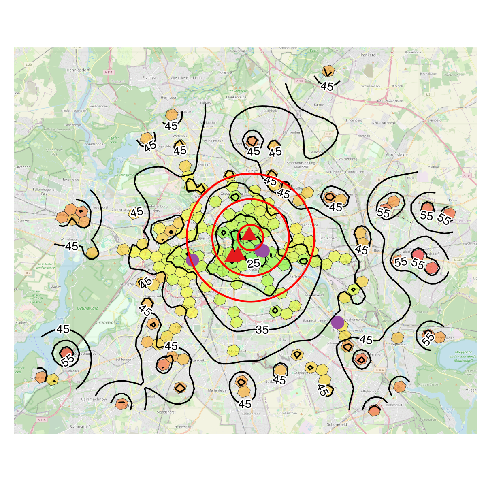

# Transit Accessibility Map in R: H3 Clustering, Routing API, and IDW Isolines

A complete R pipeline for building transit accessibility maps at city scale. Given a set of origins (hotels, venues, addresses) and destinations (POIs, landmarks, transport hubs), it calculates transit travel times via the Google Maps API, clusters origins with H3 hexagonal indexing to reduce API calls, interpolates a continuous surface using IDW, and renders isoline contour maps over an OSM basemap.

Built as a proof of concept for [this analysis](https://frequentist.org/posts/20260207-transit-time-hotel-search/). Full walkthrough in the [companion article](https://frequentist.org/posts/20260518-transit-time-under-the-hood/).



---

## What the pipeline does

1. Loads POI and hotel data from an OpenStreetMap shapefile
2. Fetches Google Places ratings to filter POIs by engagement
3. Clusters 455 hotels into 189 H3 hexagons at resolution 8, reducing routing requests from 22,750 to 9,450
4. Calculates transit travel times for all origin–destination pairs via `gmapsdistance`
5. Interpolates a continuous travel time surface using inverse distance weighting (`gstat`)
6. Renders hex-shaded maps with labelled isoline contours over an OSM tile (`ggspatial`, `metR`)
7. Models three traveller preference scenarios (mixed POIs, museums/theatres, nightlife)

---

## Key libraries

| Library | Role |
|---|---|
| `h3jsr` | H3 hexagonal indexing and cell geometry |
| `gmapsdistance` | Google Maps transit routing |
| `googleway` | Google Places API for POI ratings |
| `gstat` | Inverse distance weighting interpolation |
| `stars` | Raster grid for IDW surface |
| `metR` | Labelled isoline contours |
| `ggspatial` | OSM basemap tiles in ggplot |
| `sf` | Spatial data handling and CRS transformations |

---

## Repository structure

```
.
├── berlin-transit-time-under-the-hood.qmd   # Main Quarto document — runs end to end
├── data/
│   ├── berlin_pois_with_ratings.rds         # Cached POI data with Google ratings
│   └── berlin_hotel_poi_travel_times.csv    # Cached routing results (9,450 pairs)
└── image.png                                # Cover map (Scenario 1 output)
```

The two cached data files are included so you can run the visualisation sections without re-executing the API calls.

---

## Reproducing the results

**Prerequisites:** R 4.x, a Google Maps API key with Places and Distance Matrix enabled.

```r
# Install required packages
install.packages(c(
  "tidyverse", "sf", "h3jsr", "gmapsdistance", "googleway",
  "gstat", "stars", "metR", "ggspatial", "kableExtra", "dotenv"
))
```

Set your API key in a `.env` file in the project root:

```
GOOGLE_API_KEY=your_key_here
```

Then render the Quarto document:

```bash
quarto render berlin-transit-time-under-the-hood.qmd
```

Chunks marked `#| eval: false` are the API call sections — they write their output to `data/`. Skip them if you want to use the cached data.

---

## Adapting to your own city or use case

The pipeline is not Berlin-specific. To apply it elsewhere:

- Replace the OSM shapefile download URL with your target city's extract from [Freie Universität Berlin's spatial data](https://userpage.fu-berlin.de/soga/data/raw-data/spatial/) or [Geofabrik](https://download.geofabrik.de/)
- Adjust the H3 resolution (`res = 8`) depending on your city's size and origin density — higher resolution means smaller cells and more API calls
- Replace `fclass == "hotel"` with whatever origin class fits your problem
- Modify `poi_classes` to match your destination types
- Adjust `dx` in the IDW grid for the resolution/speed tradeoff that fits your use case

---

## Author

Aleksei Prishchepo — freelance BI and analytics consultant, Berlin.
Writing about data engineering and analytics at [frequentist.org](https://frequentist.org).
[linkedin.com/in/aleksei-pr](https://www.linkedin.com/in/aleksei-pr/)
